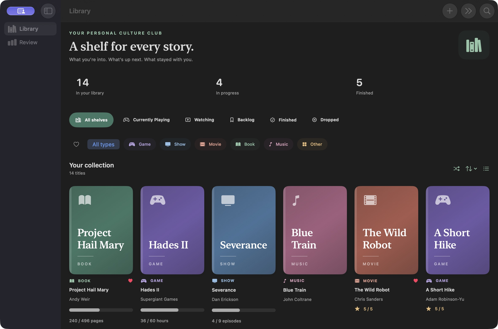
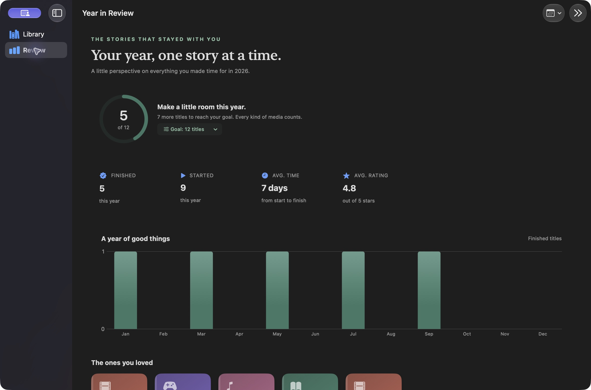

# App Shelf

A quiet home for everything you’re playing, watching, reading, and listening to. App Shelf brings your media collection, progress, personal notes, and year in review together in a native iPhone, iPad, and Mac app.

## A look inside





## Your library

- **Find anything.** Search titles, creators, notes, shelves, media types, and vibes. Combine search with shelf, media type, and favorite filters.
- **Browse your way.** Switch between an illustrated cover grid and a compact list. Sort by recent additions, title, rating, or progress.
- **Choose what’s next.** Shuffle the current selection to pick a title from your backlog. When the selection has no backlog titles, App Shelf chooses another unfinished title.
- **Make it personal.** Add cover art from Photos, or keep the automatic typographic covers. Track books, games, shows, movies, music, and anything else.
- **Keep your place.** Record pages, episodes, hours, tracks, or a custom unit. A total is optional. Log a step, adjust progress, or mark a title finished.
- **Remember the experience.** Save favorite titles, a star rating, notes, start and finish dates, and your own mood tags.

Detail editing uses a separate draft. **Save** writes the complete edit; **Cancel** discards it. Empty titles, negative progress, progress above a known total, and inverted dates are rejected. Failed saves show a message and roll back the mutation.

## Shelves and Review

App Shelf starts with Currently Playing, Watching, Backlog, Finished, and Dropped. Rename and reorder these shelves, or add your own. Built-in shelves retain their behavior when renamed. Moving a title to Finished sets its completion date and fills progress when a total is known; moving it out clears its completion date.

Review includes an adjustable annual goal, monthly completion chart, average rating and completion time, highly rated titles, media mix, and top vibes. Browse previous years with the year menu. The goal is a local device preference.

Widgets display a selected shelf in small, medium, and lock screen layouts.

## Backups and storage

The library is stored with SwiftData. The app uses a private CloudKit database when iCloud and the app’s entitlements are available, with the existing local storage fallback. The iOS app and widget share an app-group store; the Mac app uses its own application-support store.

In Settings, **Export library backup** creates a portable JSON file containing shelves, cover images, creators, progress, notes, ratings, favorites, dates, and tags. **Import a backup** previews the file before adding its missing records. Existing titles are identified by stable UUIDs and are left unchanged, so repeating an import does not create duplicate titles or overwrite newer notes. Empty shelves and item order are preserved. Invalid versions, missing shelf references, duplicate IDs, invalid ratings/progress, excessive record counts, and files over 50 MB are rejected before import. Failed imports roll back their changes.

Existing SwiftData relationship names and optional relationships are retained. New metadata fields use defaults or optional storage to support lightweight store migration and CloudKit’s schema requirements. Backup identifiers are assigned per record before opening the synced container, avoiding shared UUID defaults during migration; missing or duplicate identifiers are repaired once. Publish the updated CloudKit schema from a development-signed build before distributing an iCloud-enabled release.

## Build and run

Requires Xcode 16 or newer, iOS 17 or newer, and macOS 14 or newer. The project uses XcodeGen and has no external package dependencies.

```sh
brew install xcodegen
xcodegen generate
open "App Shelf.xcodeproj"
```

Choose **App Shelf** for iPhone/iPad or **App Shelf Mac** for macOS. Regenerate the project whenever adding source files or changing `project.yml`.

For an unsigned simulator build:

```sh
xcodebuild -project "App Shelf.xcodeproj" -scheme "App Shelf" \
  -destination 'generic/platform=iOS Simulator' \
  -derivedDataPath work/DerivedData CODE_SIGNING_ALLOWED=NO build
```

For a local Mac build:

```sh
xcodebuild -project "App Shelf.xcodeproj" -scheme "App Shelf Mac" \
  -destination 'platform=macOS' \
  -derivedDataPath work/DerivedData-Mac CODE_SIGNING_ALLOWED=NO build
```

The iOS scheme also builds the widget. A physical device or production iCloud build needs the configured app group, CloudKit container, and signing capabilities.

## Preview library

For a portfolio screenshot or a quick walkthrough, set `APPSHELF_DEMO_LIBRARY=1` in a Debug scheme’s launch environment. This creates a disposable, in-memory library with a representative mix of titles, progress, favorites, notes, and completion history. It does not open or migrate the persistent library. Release builds ignore this option.

With an already installed simulator app:

```sh
SIMCTL_CHILD_APPSHELF_DEMO_LIBRARY=1 xcrun simctl launch \
  --terminate-running-process booted com.appshelf.AppShelf
```

For local verification without iCloud, set `APPSHELF_DISABLE_CLOUDKIT=1`. CloudKit is also disabled automatically in the test host and widget extension.

## Verification

```sh
xcodebuild -project "App Shelf.xcodeproj" -scheme "App Shelf" \
  -destination 'platform=iOS Simulator,name=iPhone 17 Pro' \
  -derivedDataPath work/DerivedData CODE_SIGNING_ALLOWED=NO test
```

The Swift Testing suite covers the models, ordering and move behavior, seed reconciliation, storage selection, image compression, statistics, search/filter composition, draft isolation and validation, backup round trips, repeated imports, invalid archives, completion behavior after renaming Finished, and migrated identifier reconciliation. A separate real SQLite-store migration check also preserves the prior schema’s notes, cover data, ratings, shelves, and tag relationships while assigning distinct identifiers. The latest full run passed **109 tests across 10 suites**.
